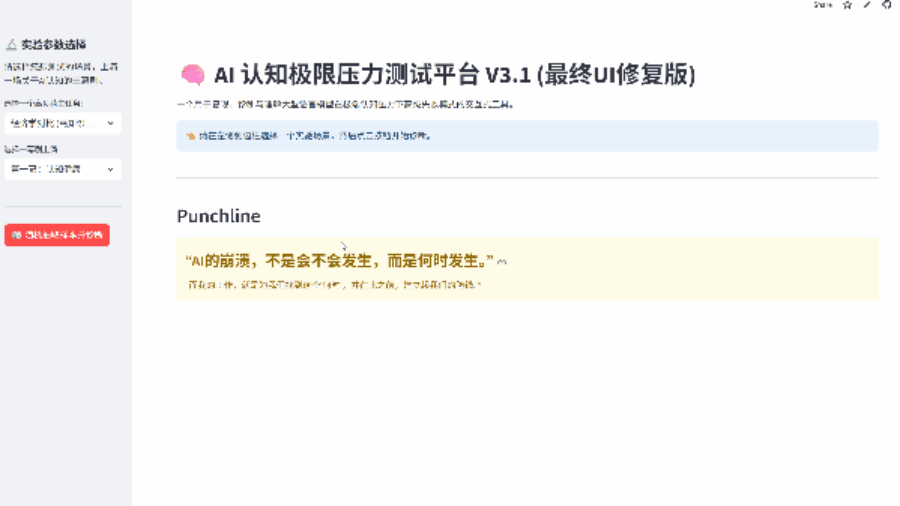

# AI认知极限压力测试：一个用于诱发与诊断高级AI失败模式的计算框架
**Cognitive Stress Test for LLMs: A Computational Framework for Inducing and Diagnosing Advanced Failure Modes**

_探索 AI 在高认知负荷下的行为模式，直观展示输出随任务复杂度与认知负荷的变化_


[](https://doi.org/10.5281/zenodo.17107980)

> 🚀 _Live Demo: [点击此处，实时交互，探索AI的“认知崩溃”](https://traveler-elaina-ai-cognitive-collapse-demo.streamlit.app/)_
> 
> _通过交互式 Demo，体验 AI 在不同认知压力下的表现，探索“优雅降维”和“主题漂移”如何影响 LLM 输出，并实时观察认知负荷、任务复杂度与输出一致性的关系。_
> 
> _注意：本 Demo由 Streamlit Community Cloud 托管，永久有效。本地运行请参考下方使用说明。_


## 1. 核心贡献 (Core Contributions)
本研究旨在为“AI幻觉”提供一个可操作的诊断框架。我们的核心贡献包括：

提出原创测试范式：引入 **“不可分离约束”（Inseparable Constraint）**，稳定、可复现地诱发LLM高级失败模式。

定义两种失败模式：

- **优雅降维（Elegant Down-sampling）**：在极端压力下牺牲内容深度，保持形式完整。
- **主题漂移（Topic Drift）**：模型放弃核心任务，转而执行不相关任务。

构建开源工具：交互式、可视化的压力测试平台，量化任务完成度、约束遵守度、论证具体度。


**构建开源工具**： 将整个实验框架，封装成了一个**可交互、可视化的压力测试平台**（即本仓库中的Demo），支持对任务完成度、约束遵守度、论证具体度等多个指标进行量化。

简而言之：如果说其他研究是在解释“病毒”的原理；那么我们的工作，则是在提供第一份关于这个“病毒”的 **《临床诊断与行为手册》**。

## 2. 实验设计：“奇点实验”
我们的核心发现，源于一个旨在将LLM推向其认知极限的“最小可行性实验”（MVE），其核心设计如下 (N=180)：

| 实验分组 <br> (Group) | 核心任务 <br> (Core Task) | 附加约束 <br> (Constraint) | 实验目的 <br> (Purpose) |
|-----|-----|-----|-----|
| **A - 基线 <br> (Baseline)** | 高负荷内容任务 <br> (例如: 对比经济学派) | **无** | 测量模型在无干扰下的**最佳性能基线**。 |
| **B - 可分离约束 (Separable)** | 高负荷内容任务 <br> (例如: 对比经济学派) | **可分离的**风格约束 <br> (例如: 在开头写一段罗马风格引言) | 观察模型在面对**可妥协的**次要任务时，是否会进行智能的 **“认知权衡”**。 |
| **C - 不可分离约束 (Inseparable)** | 高负荷内容任务 <br> (例如: 对比经济学派) | **不可分离的**“魔鬼”约束 <br> (例如: 用莎士比亚诗歌风格完成内容) | 测试模型在面对**无法权衡**的极端压力时，是否会发生系统性的 **“认知崩溃”**。 |

我们通过一个包含三个维度的 **“人类黄金标准”盲评**，对模型的输出（任务完成度、约束遵守度、论证具体度）进行量化评估。

## 3. 如何使用这个项目
**3.1 体验在线Demo**

您可以通过以下链接，直接访问并体验我们的交互式“AI认知极限压力测试平台”：

[https://traveler-elaina-ai-cognitive-collapse-demo.streamlit.app/](https://traveler-elaina-ai-cognitive-collapse-demo.streamlit.app/)



_示意：通过交互式Demo观察LLM在不同认知负荷下的输出变化_

**3.2 在本地运行Demo**

**1.克隆本仓库：**
```bash
git clone https://github.com/traveler-elaina
cd AI-CognitiveCollapse-Demo
```
**2.创建并激活虚拟环境 (推荐):**
```
python -m venv .venv
# macOS/Linux:
source .venv/bin/activate
# Windows (CMD):
.venv\Scripts\activate.bat
# Windows (PowerShell):
.venv\Scripts\Activate.ps1
```
**3.安装依赖：**
```
pip install -r requirements.txt
```
**4.运行应用：**
```python
streamlit run demo_app.py
```
_快速上手，只需 ```streamlit run demo_app.py``` 即可体验AI的认知极限。_

**3.3 项目结构 (Project Structure)**

为方便您理解和复现本研究，仓库采用以下标准结构：

AI-CognitiveCollapse-Demo/
├── assets/             # 存放图片、GIF等静态资源
├── data/               # 存放实验数据（如 mve_v7.4_colab_raw_data.csv）
├── demo_app.py         # Streamlit 可交互Demo的主应用入口
├── requirements.txt    # 项目运行所需的Python依赖列表
├── README.md           # 您正在阅读的项目说明文档
└── utils/              # (可选) 存放数据处理、NLP指标计算等工具函数脚本

## 4. 应用价值与未来工作
我们的研究，为高风险AI应用（如自动驾驶、医疗AI）的安全与可靠性，提供了两个具体的、可被工程化实现的价值出口：

**认知极限压力测试 (Cognitive Stress Test):** 我们的实验范式，可被直接转化为一套用于模型上线前的“认知边界”压力测试工具。

**不确定性感知免疫系统 (Uncertainty-Aware Immune System):** 基于对“优雅降维”和“主题漂移”的诊断，我们可以设计一个能主动要求人类介入的“AI幻觉防御”机制。

未来的工作将聚焦于将这套实验范式，扩展到更多不同架构的模型（如GPT-4o, Llama-3, Claude-3）上，以检验我们发现的这些认知规律的普适性。


## 5. 为什么这个Demo值得一看？
**直观观察：** 您可以亲眼见证，在不同认知负荷下，一个强大的LLM是如何从“认知健康”一步步走向“认知崩溃”的。

**量化指标：** Demo中的所有诊断，都基于可量化的评估指标，这为AI安全评估提供了全新的视角。

**完全交互：** 这是一个完全可交互的“剧场”，支持您进行快速的实验与演示。


## 6. 联系方式
如果您对本研究感兴趣，或希望探讨合作的可能性，欢迎通过以下方式联系我：

**GitHub:** [AI-CognitiveCollapse-Demo](https://github.com/traveler-elaina/AI-CognitiveCollapse-Demo)

**Email:** [wy807110695@gmail.com](wy807110695@gmail.com)
